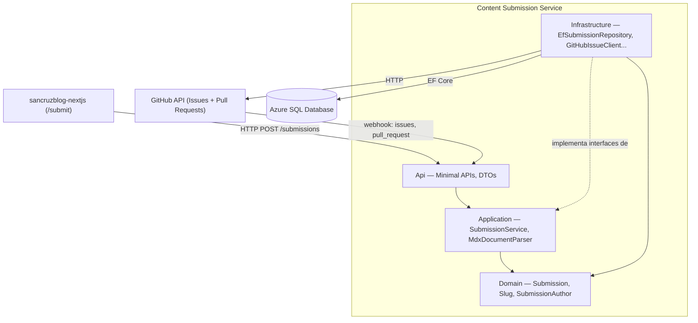
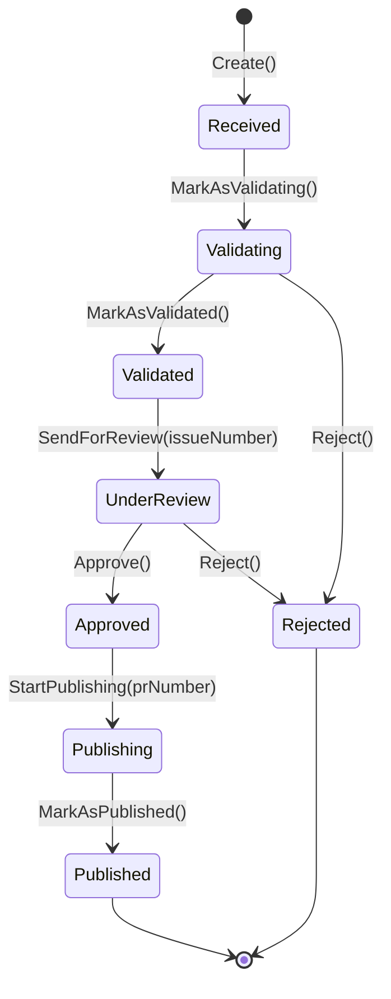
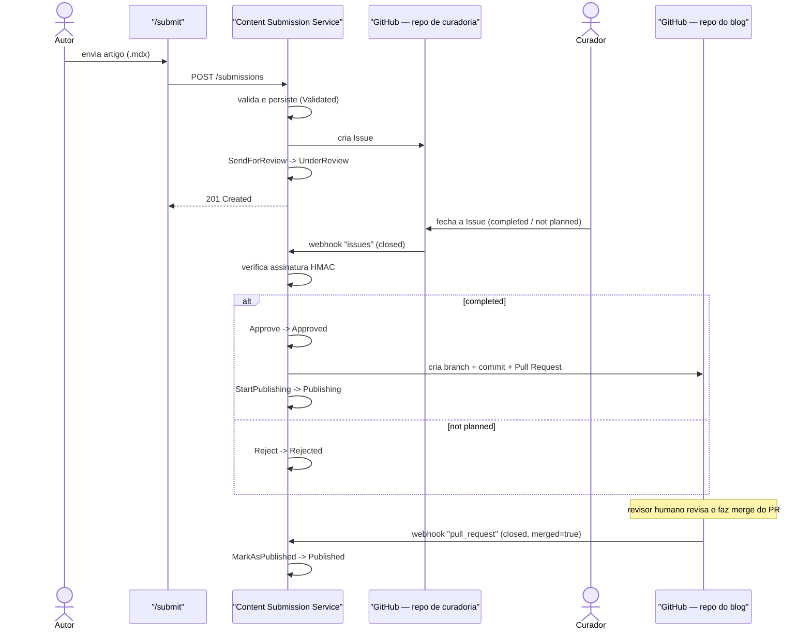
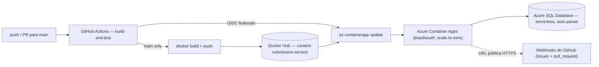

# Content Submission Service


Serviço de domínio responsável por receber, validar e conduzir submissões de
artigos técnicos através de um workflow de curadoria humana até a publicação
no [blog](https://github.com/sancruz-dev/sancruzblog-nextjs). Ver
[docs/architecture.md](docs/architecture.md) para a visão completa do
sistema e o roadmap de fases.

## Stack

- .NET 9 / ASP.NET Core (Minimal APIs)
- EF Core + SQL Server (Azure SQL Database serverless em produção)
- xUnit + `Microsoft.AspNetCore.Mvc.Testing` para testes de integração
- GitHub Issues + Pull Requests como mecanismo de curadoria (webhooks)
- Docker + GitHub Actions, deploy em Azure Container Apps

## Arquitetura

Um serviço de domínio único (não um conjunto de microsserviços por
responsabilidade), organizado em camadas de Clean Architecture. O Next.js
chama esta API diretamente do navegador — daí o CORS explícito — e a API
conversa com o GitHub nos dois sentidos: chamadas HTTP de saída (criar Issue,
criar PR) e webhooks de entrada (Issue fechada, PR mergeado).



Mensageria (RabbitMQ) e curadoria via Pipefy foram avaliadas e descartadas
do roadmap — ver [ADR-001](docs/decisions/ADR-001-why-a-separate-submission-service.md)
e [ADR-002](docs/decisions/ADR-002-why-not-rabbitmq-and-pipefy.md).

## Estrutura

```
src/
  ContentSubmission.Domain/          # Submission, regras de transição de estado, value objects
  ContentSubmission.Application/     # casos de uso (SubmissionService)
  ContentSubmission.Infrastructure/  # implementações concretas (EF Core, clientes GitHub)
  ContentSubmission.Api/             # endpoints HTTP (ASP.NET Core Minimal APIs)
tests/
  ContentSubmission.Domain.Tests/    # regras de negócio e máquina de estados
  ContentSubmission.Application.Tests/
  ContentSubmission.Infrastructure.Tests/
  ContentSubmission.Api.Tests/       # testes de integração via WebApplicationFactory
docs/
  architecture.md
  decisions/                         # ADRs
```

## Ciclo de vida da submissão



Falha e retry deliberadamente **não** são estados da `Submission` — modelar
`FAILED`/`RETRYING` no enum principal explodiria a máquina de estados sem
necessidade. Raciocínio completo em
[docs/architecture.md](docs/architecture.md#ciclo-de-vida-da-submission).

## Workflow de curadoria

A aprovação não acontece dentro deste serviço: a curadoria é feita via
GitHub Issues, criadas num
[repositório privado dedicado](https://github.com/sancruz-dev/sancruzblog-content-curation),
separado tanto deste serviço quanto do blog (ver
[ADR-003](docs/decisions/ADR-003-curadoria-via-github-issues.md)). Fechar a
Issue como "completed" aprova a submissão e dispara a criação automática de
um Pull Request no repositório do blog; fechar como "not planned" rejeita.



Os dois webhooks chegam no mesmo endpoint (`POST /webhooks/github`),
diferenciados pelo header `X-GitHub-Event`; a assinatura HMAC
(`X-Hub-Signature-256`) é verificada antes de qualquer processamento, com
comparação em tempo constante.

## Rodando localmente

```bash
dotnet run --project src/ContentSubmission.Api
```

A API sobe em `http://localhost:5211` (ou na porta definida em
`src/ContentSubmission.Api/Properties/launchSettings.json`).

Alternativa via Docker (sobe também um SQL Server dedicado): ver
[docs/local-development.md](docs/local-development.md).

## Configuração

Não-secreto (versionado em `appsettings.Development.json`):

- `Cors:AllowedOrigins` — origens permitidas a chamar a API do navegador (em dev, `http://localhost:3000`)
- `ConnectionStrings:SubmissionDb` — connection string do SQL Server local
- `GitHub:Owner`, `GitHub:CurationRepo`, `GitHub:BlogRepo`, `GitHub:DefaultBranch` — os dois repositórios GitHub que o serviço integra

Secreto, via [.NET User Secrets](https://learn.microsoft.com/aspnet/core/security/app-secrets) (nunca commitado):

- `GitHub:Token` — PAT com escopo de `Contents`/`Pull requests` no repo do blog e `Issues` no repo de curadoria
- `GitHub:WebhookSecret` — valida a assinatura HMAC dos webhooks recebidos

### Endpoints

```
POST /submissions        cria uma submissão (multipart/form-data: file .mdx + authorEmail)
POST /webhooks/github    recebe webhooks do GitHub (issues, pull_request) — ver workflow de curadoria acima
```

`GET /submissions` e `GET /submissions/{id}` existiram até a Fase 9 e foram
removidos (ADR-006): não eram usados pelo frontend e expunham o e-mail de
todo autor a qualquer requisição não autenticada. Consultas administrativas
agora são feitas direto no Azure SQL / Log Analytics.

Exemplo — o upload é sempre um arquivo `.mdx` com frontmatter YAML; título,
slug, autor, categoria, nível e tags vêm todos do frontmatter, não de campos
de formulário separados (só `authorEmail` é um campo à parte):

```bash
cat > /tmp/artigo.mdx <<'EOF'
---
title: "Como funciona RabbitMQ"
description: "Introdução à mensageria."
slug: como-funciona-rabbitmq
author: "João da Silva"
category: "Backend"
level: "Intermediate"
tags:
  - rabbitmq
  - messaging
---

Corpo do artigo em Markdown/MDX.
EOF

curl -X POST http://localhost:5211/submissions \
  -F "file=@/tmp/artigo.mdx;type=text/markdown" \
  -F "authorEmail=joao@example.com"
```

## Testes

```bash
dotnet test
```

Quatro projetos, cada um testando uma camada diferente:

| Projeto | O que testa |
|---|---|
| `ContentSubmission.Domain.Tests` | Regras de negócio e a máquina de estados da `Submission` |
| `ContentSubmission.Application.Tests` | Casos de uso (`SubmissionService`) com fakes locais |
| `ContentSubmission.Infrastructure.Tests` | `EfSubmissionRepository` contra SQLite em memória |
| `ContentSubmission.Api.Tests` | Comportamento HTTP/validação via `WebApplicationFactory`, com `InMemorySubmissionRepository` |

Detalhes de cada estratégia em
[docs/architecture.md](docs/architecture.md#estratégia-de-testes).

### Provocando falhas de propósito

Para ver as validações de domínio rejeitando entrada inválida (sem precisar
ler o código):

```bash
# slug com tentativa de path traversal -> 400
cat > /tmp/slug-invalido.mdx <<'EOF'
---
title: "x"
description: "y"
slug: ../../etc/passwd
author: "a"
category: "Backend"
level: "Intermediate"
tags: []
---

corpo
EOF

curl -X POST http://localhost:5211/submissions \
  -F "file=@/tmp/slug-invalido.mdx;type=text/markdown" \
  -F "authorEmail=a@a.com"
```

```bash
# level fora do enum -> 400
cat > /tmp/nivel-invalido.mdx <<'EOF'
---
title: "x"
description: "y"
slug: algum-slug
author: "a"
category: "Backend"
level: "Expert"
tags: []
---

corpo
EOF

curl -X POST http://localhost:5211/submissions \
  -F "file=@/tmp/nivel-invalido.mdx;type=text/markdown" \
  -F "authorEmail=a@a.com"
```

No domínio, `SlugTests` e `SubmissionAuthorTests` cobrem especificamente
tentativas de path traversal e e-mails malformados; `SubmissionTests` cobre
transições de estado inválidas (ex: pular direto de `Received` para
`UnderReview`).

## CI/CD e deploy



CI roda em todo push/PR para `main`: restore, build, `dotnet test`, build da
imagem Docker. O job de deploy só roda em push para `main` e só depois do CI
passar: publica a imagem no Docker Hub e atualiza o Azure Container App via
`az containerapp update`, autenticado por OIDC federado — nenhum client
secret de longa duração fica armazenado. Ver
[ADR-004](docs/decisions/ADR-004-deploy-azure-container-apps.md).

Rodando em produção:
[app-sancruzblog-submission](https://app-sancruzblog-submission.whitepond-0bc7fc1e.brazilsouth.azurecontainerapps.io)
(Azure Container Apps, plano consumption, escala a zero sem tráfego).

## Documentação

- [docs/architecture.md](docs/architecture.md) — visão completa do sistema, camadas, modelagem de dados e o que ainda falta implementar
- [docs/local-development.md](docs/local-development.md) — rodando nativo vs. via Docker Compose
- ADRs: [001 — por que um serviço separado](docs/decisions/ADR-001-why-a-separate-submission-service.md) · [002 — por que não RabbitMQ/Pipefy](docs/decisions/ADR-002-why-not-rabbitmq-and-pipefy.md) · [003 — curadoria via GitHub Issues](docs/decisions/ADR-003-curadoria-via-github-issues.md) · [004 — deploy no Azure Container Apps](docs/decisions/ADR-004-deploy-azure-container-apps.md) · [006 — resiliência e security hardening](docs/decisions/ADR-006-resiliencia-e-security-hardening.md)
